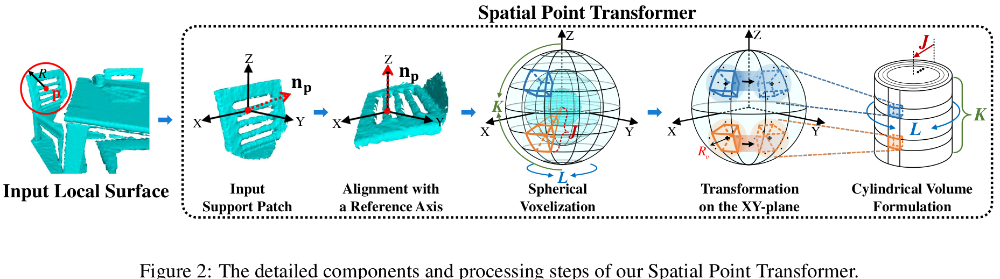

[](https://paperswithcode.com/sota/point-cloud-registration-on-3dmatch-benchmark?p=spinnet-learning-a-general-surface-descriptor)
[](https://creativecommons.org/licenses/by-nc-sa/4.0/legalcode)
[](https://arxiv.org/abs/2011.12149)
# SpinNet: Learning a General Surface Descriptor for 3D Point Cloud Registration (CVPR 2021)

This is the official repository of **SpinNet**, a conceptually simple neural architecture to extract local 
features which are rotationally invariant whilst sufficiently informative to enable accurate registration. For technical details, please refer to:

**[SpinNet: Learning a General Surface Descriptor for 3D Point Cloud Registration](https://arxiv.org/abs/2011.12149)**  <br />
[Sheng Ao*](http://scholar.google.com/citations?user=cvS1yuMAAAAJ&hl=zh-CN), [Qingyong Hu*](https://www.cs.ox.ac.uk/people/qingyong.hu/), [Bo Yang](https://yang7879.github.io/), [Andrew Markham](https://www.cs.ox.ac.uk/people/andrew.markham/), [Yulan Guo](http://yulanguo.me/). <br />
(* *indicates equal contribution*)

**[[Paper](https://arxiv.org/abs/2011.12149)] [Video] [Project page]** <br />


### (1) Overview

<p align="center">  </p>

<p align="center">  </p>


### (2) Setup
This code has been tested with Python 3.6, Pytorch 1.6.0, CUDA 10.2 on Ubuntu 18.04.
 
- Clone the repository 
```
git clone https://github.com/QingyongHu/SpinNet && cd SpinNet
```
- Setup conda virtual environment
```
conda create -n spinnet python=3.6
source activate spinnet
conda install pytorch==1.6.0 torchvision==0.7.0 cudatoolkit=10.2 -c pytorch
conda install -c open3d-admin open3d==0.11.1
pip install "git+git://github.com/erikwijmans/Pointnet2_PyTorch.git#egg=pointnet2_ops&subdirectory=pointnet2_ops_lib"
```

### (3) 3DMatch
Download the processed dataset from [Google Drive](https://drive.google.com/file/d/1PrkSE0nY79gOF_VJcKv2VpxQ8s7DOITg/view?usp=sharing), [Baidu Yun](https://pan.baidu.com/s/1FB7IUbKAAlk7RVnB_AgwcQ) (Verification code:d1vn) and put the folder into `data`. 
Then the structure should be as follows:
```
--data--3DMatch--fragments
              |--intermediate-files-real
              |--patches

```

**Training**

Training SpinNet on the 3DMatch dataset:
```
cd ./ThreeDMatch/Train
python train.py
```
**Testing**

Evaluate the performance of the trained models on the 3DMatch dataset:

```
cd ./ThreeDMatch/Test
python preparation.py
```
The learned descriptors for each point will be saved in `ThreeDMatch/Test/SpinNet_{timestr}/` folder. 
Then the `Feature Matching Recall(FMR)` and `Inlier Ratio(IR)` can be calculated by running:
```
python evaluate.py [timestr]
```
The ground truth poses have been put in the `ThreeDMatch/Test/gt_result` folder. 
The `Registration Recall` can be calculated by running the `evaluate.m` in `ThreeDMatch/Test/3dmatch` which are provided by [3DMatch](https://github.com/andyzeng/3dmatch-toolbox/tree/master/evaluation/geometric-registration).
Note that, you need to modify the `descriptorName` to `SpinNet_{timestr}` in the `ThreeDMatch/Test/3dmatch/evaluate.m` file.


### (4) KITTI
Download the processed dataset from [Google Drive](https://drive.google.com/file/d/1fuJiQwAay23BUKtxBG3__MwStyMuvrMQ/view?usp=sharing), [Baidu Yun](https://pan.baidu.com/s/1FB7IUbKAAlk7RVnB_AgwcQ) (Verification code:d1vn), and put the folder into `data`. 
Then the structure is as follows:
```
--data--KITTI--dataset
            |--icp
            |--patches

```

**Training**

Training SpinNet on the KITTI dataset:

```
cd ./KITTI/Train/
python train.py
```

**Testing**

Evaluate the performance of the trained models on the KITTI dataset:

```
cd ./KITTI/Test/
python test_kitti.py
```


### (5) ETH

The test set can be downloaded from [here](https://share.phys.ethz.ch/~gsg/3DSmoothNet/data/ETH.rar), and put the folder into `data`, then the structure is as follows:
```
--data--ETH--gazebo_summer
          |--gazebo_winter
          |--wood_autmn
          |--wood_summer
```

### (6) Generalization across Unseen Datasets 

**3DMatch to ETH**

Generalization from 3DMatch dataset to ETH dataset:
```
cd ./generalization/ThreeDMatch-to-ETH
python preparation.py
```
The descriptors for each point will be generated and saved in the `generalization/ThreeDMatch-to-ETH/SpinNet_{timestr}/` folder. 
Then the `Feature Matching Recall` and `inlier ratio` can be caluclated by running
```
python evaluate.py [timestr]
```

**3DMatch to KITTI**

Generalization from 3DMatch dataset to KITTI dataset:

```
cd ./generalization/ThreeDMatch-to-KITTI
python test.py
```

**KITTI to 3DMatch**

Generalization from KITTI dataset to 3DMatch dataset:
```
cd ./generalization/KITTI-to-ThreeDMatch
python preparation.py
```
The descriptors for each point will be generated and saved in `generalization/KITTI-to-3DMatch/SpinNet_{timestr}/` folder. 
Then the `Feature Matching Recall` and `inlier ratio` can be caluclated by running
```
python evaluate.py [timestr]
```

## Acknowledgement

In this project, we use (parts of) the implementations of the following works:

* [Pointnet2_PyTorch](https://github.com/erikwijmans/Pointnet2_PyTorch)
* [PPF-FoldNet](https://github.com/XuyangBai/PPF-FoldNet)
* [Spherical CNNs](https://github.com/jonas-koehler/s2cnn)
* [FCGF](https://github.com/chrischoy/FCGF)
* [r2d2](https://github.com/naver/r2d2)
* [D3Feat](https://github.com/XuyangBai/D3Feat)
* [D3Feat.pytorch](https://github.com/XuyangBai/D3Feat.pytorch)


### Citation
If you find our work useful in your research, please consider citing:

    @inproceedings{ao2020SpinNet,
      title={SpinNet: Learning a General Surface Descriptor for 3D Point Cloud Registration},
      author={Ao, Sheng and Hu, Qingyong and Yang, Bo and Markham, Andrew and Guo, Yulan},
      booktitle={Proceedings of the IEEE/CVF Conference on Computer Vision and Pattern Recognition},
      year={2021}
    }

### References
<a name="refs"></a>

[1] 3DMatch: Learning Local Geometric Descriptors from RGB-D Reconstructions, Andy Zeng, Shuran Song, Matthias Nießner, Matthew Fisher, Jianxiong Xiao, and Thomas Funkhouser, CVPR 2017.


### Updates
* 03/04/2021: The code is released!
* 01/03/2021: This paper has been accepted by CVPR 2021!
* 25/11/2020: Initial release!

## Related Repos
1. [RandLA-Net: Efficient Semantic Segmentation of Large-Scale Point Clouds](https://github.com/QingyongHu/RandLA-Net) 
2. [SoTA-Point-Cloud: Deep Learning for 3D Point Clouds: A Survey](https://github.com/QingyongHu/SoTA-Point-Cloud) 
3. [3D-BoNet: Learning Object Bounding Boxes for 3D Instance Segmentation on Point Clouds](https://github.com/Yang7879/3D-BoNet) 
4. [SensatUrban: Learning Semantics from Urban-Scale Photogrammetric Point Clouds](https://github.com/QingyongHu/SensatUrban) 
5. [SQN: Weakly-Supervised Semantic Segmentation of Large-Scale 3D Point Clouds with 1000x Fewer Labels](https://github.com/QingyongHu/SQN) 

