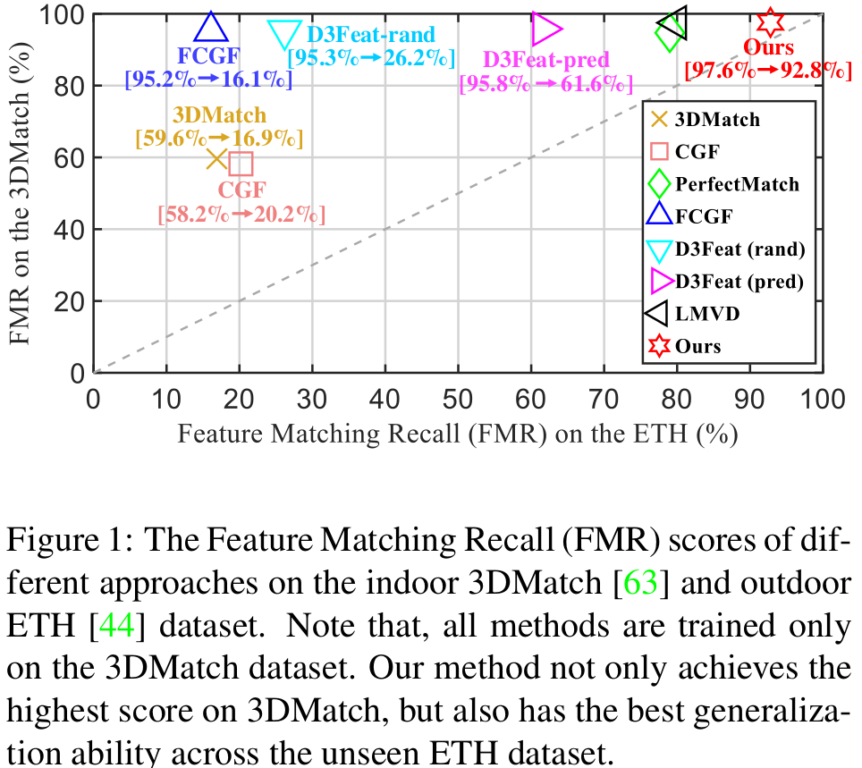
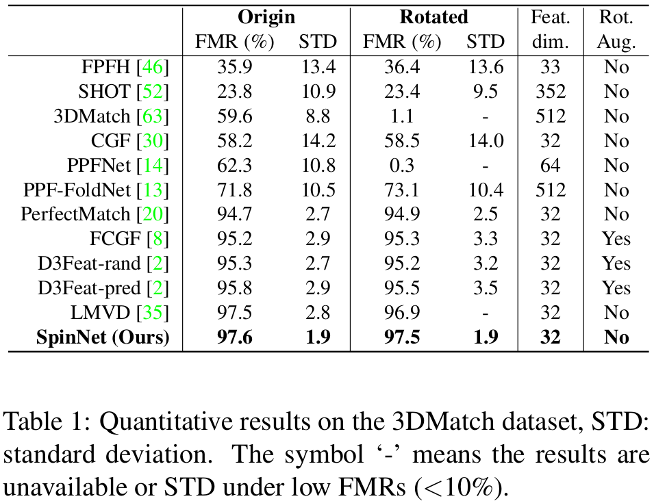
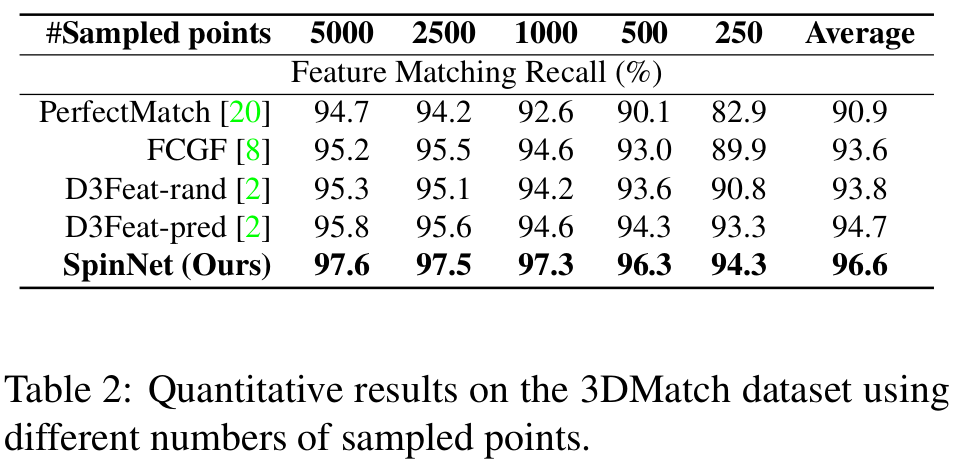
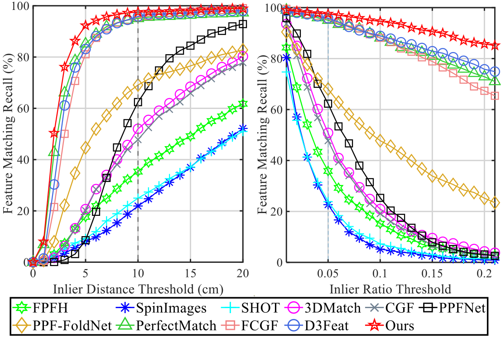
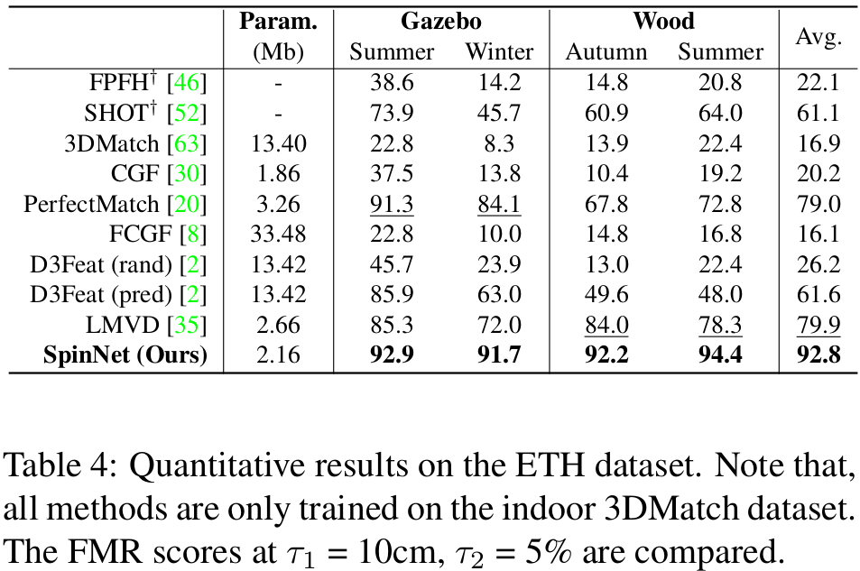
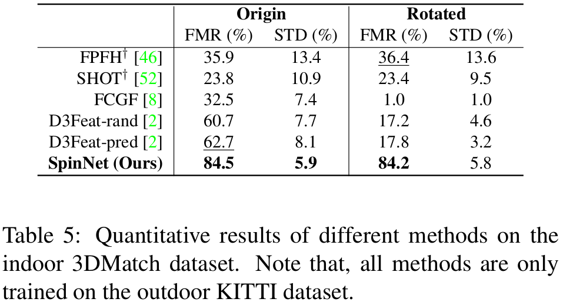
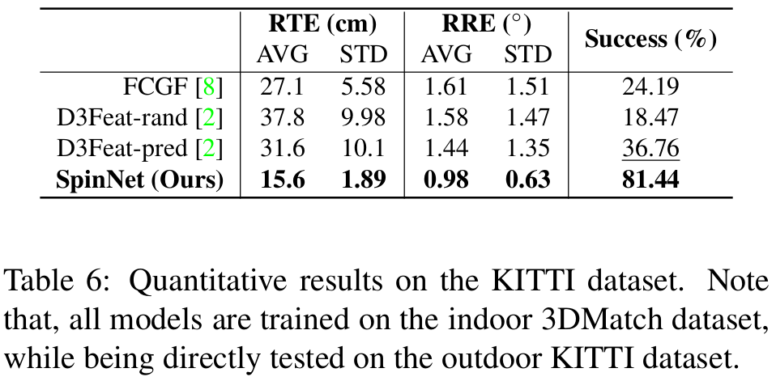

# SpinNet: Learning a General Surface Descriptor for 3D Point Cloud Registration (CVPR 2021)

This is the official repository of **SpinNet** ([[Arxiv report](https://arxiv.org/abs/2011.12149)]), a conceptually simple neural architecture to extract local 
features which are rotationally invariant whilst sufficiently informative to enable accurate registration. For technical details, please refer to:

**SpinNet: Learning a General Surface Descriptor for 3D Point Cloud Registration**   
[Sheng Ao*](http://scholar.google.com/citations?user=cvS1yuMAAAAJ&hl=zh-CN), [Qingyong Hu*](https://www.cs.ox.ac.uk/people/qingyong.hu/), [Bo Yang](https://yang7879.github.io/), [Andrew Markham](https://www.cs.ox.ac.uk/people/andrew.markham/), [Yulan Guo](http://yulanguo.me/).  
(* *indicates equal contribution*)

**[[Paper](https://arxiv.org/abs/2011.12149)] [Video] [Project page]**  

### (1) Overview

  

  

  

### (2) Results on Public Datasets

- #### Comparisons with the State-of-the-arts.

  

- #### Performance under Different Number of Sampled Points

  

- #### Performance under Different Error Thresholds

  

### (3) Generalization Performance
- #### Generalization From 3DMatch to ETH

  

- #### Generalization From KITTI to 3DMatch 

  

- #### Generalization From 3DMatch to KITTI

  

### (4) Qualitative Results

  

### Citation
If you find our work useful in your research, please consider citing:

    @inproceedings{ao2020SpinNet,
      title={SpinNet: Learning a General Surface Descriptor for 3D Point Cloud Registration},
      author={Ao, Sheng and Hu, Qingyong and Yang, Bo and Markham, Andrew and Guo, Yulan},
      booktitle={arXiv preprint arXiv:2011.12149},
      year={2021}
    }

### Updates
* 01/03/2021: This paper has been accepted by CVPR 2021!
* 25/11/2020: Initial release!

## Related Repos
1. [RandLA-Net: Efficient Semantic Segmentation of Large-Scale Point Clouds](https://github.com/QingyongHu/RandLA-Net) 
2. [SoTA-Point-Cloud: Deep Learning for 3D Point Clouds: A Survey](https://github.com/QingyongHu/SoTA-Point-Cloud) 
3. [3D-BoNet: Learning Object Bounding Boxes for 3D Instance Segmentation on Point Clouds](https://github.com/Yang7879/3D-BoNet) 
4. [SensatUrban: Learning Semantics from Urban-Scale Photogrammetric Point Clouds](https://github.com/QingyongHu/SpinNet) 

